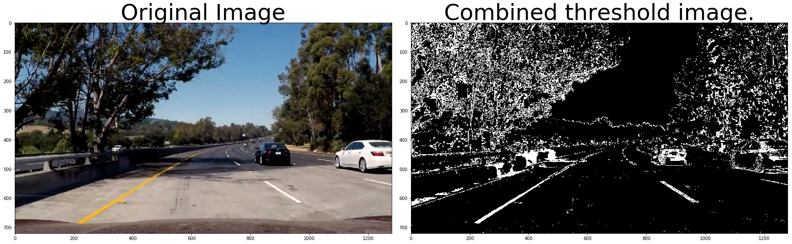

# Advanced Lane Lines

In this project, the goal is to write a software pipeline to identify the lane boundaries in a video

The goals / steps of this project are the following:
1. Compute the camera calibration matrix and distortion coefficients given a set of chessboard images.
2. Apply a distortion correction to raw images.
3. Use color transforms, gradients, etc., to create a thresholded binary image.
4. Apply a perspective transform to rectify binary image ("birds-eye view").
5. Detect lane pixels and fit to find the lane boundary.
6. Determine the curvature of the lane and vehicle position with respect to center.
7. Warp the detected lane boundaries back onto the original image.
8. Output visual display of the lane boundaries and numerical estimation of lane curvature and vehicle position.


# 1. Camera Calibration

The code for this step is contained in the first code cell of the IPython notebook.

I start by preparing "object points", which will be the (x, y, z) coordinates of the chessboard corners in the world. Here I am assuming the chessboard is fixed on the (x, y) plane at z=0, such that the object points are the same for each calibration image.  Thus, `objp` is just a replicated array of coordinates, and `objpoints` will be appended with a copy of it every time I successfully detect all chessboard corners in a test image.  `imgpoints` will be appended with the (x, y) pixel position of each of the corners in the image plane with each successful chessboard detection.  


I then used the output `objpoints` and `imgpoints` to compute the camera calibration and distortion coefficients using the `cv2.calibrateCamera()` function.  I applied this distortion correction to the test image using the `cv2.undistort()` function and obtained the following result:


# Pipeline for single images

### Correct distortion

I load the camera parameters previously calculated and use them to undistort the following image


### Create a thresholded binary image

I used a combination of color and gradient thresholds to generate a binary image.




### Perspective Transform

Next, we want to identify four source points for the perspective transform. In this case, we assume the road is a flat plane. This isn't strictly true, but it can serve as an approximation for this project. We pick four points in a trapezoidal shape that would represent a rectangle when looking down on the road from above.

The code for my perspective transform includes a function called `warper()`.  The `warper()` function takes as inputs an image (`img`).  I chose the hardcode the source and destination points in the following manner:

```python
src = np.float32(
    [[(img_size[0] / 2) - 55, img_size[1] / 2 + 100],
    [((img_size[0] / 6) - 10), img_size[1]],
    [(img_size[0] * 5 / 6) + 60, img_size[1]],
    [(img_size[0] / 2 + 55), img_size[1] / 2 + 100]])
dst = np.float32(
    [[(img_size[0] / 4), 0],
    [(img_size[0] / 4), img_size[1]],
    [(img_size[0] * 3 / 4), img_size[1]],
    [(img_size[0] * 3 / 4), 0]])
```

This resulted in the following source and destination points:

| Source        | Destination   | 
|:-------------:|:-------------:| 
| 585, 460      | 320, 0        | 
| 203, 720      | 320, 720      |
| 1127, 720     | 960, 720      |
| 695, 460      | 960, 0        |

I verified that the perspective transform is working as expected by drawing the `src` and `dst` points onto a test image and its warped counterpart to verify that the lines appear parallel in the warped image.


### Line finding method : sliding windows

After applying calibration, thresholding, and a perspective transform to a road image, you should have a binary image where the lane lines stand out clearly. However, you still need to decide explicitly which pixels are part of the lines and which belong to the left line and which belong to the right line.

I first take a histogram along all the columns in the lower half of the image. With this histogram I am adding up the pixel values along each column in the image. In my thresholded binary image, pixels are either 0 or 1, so the two most prominent peaks in this histogram will be good indicators of the x-position of the base of the lane lines. I can use that as a starting point for where to search for the lines. From that point, I can use a sliding window, placed around the line centers, to find and follow the lines up to the top of the frame.


Now we know where the lines are ! In the next frame of video we don't need to do a blind search again, but instead we can just search in a margin around the previous line position like this:


Let's visualize the search window area 


### Radius of curvature and position of the vehicle

First we calculate the radius of curvature in the pixel space, and then we convert it to actual meters. The values we get for the test image are 675m and 784m. This is the right order of magnitude. We also calculate the offset between the camera and the center of the lane.


### Example

We have a warped binary image called wrapped_img, and we have fit the lines with a polynomial and have arrays called ploty, left_fitx and right_fitx, which represent the x and y pixel values of the lines. We can then project those lines onto the original image as implemented in the function "map_lane" of the Jupyter notebook.


# Video Pipeline

See the output video in the project repository.


